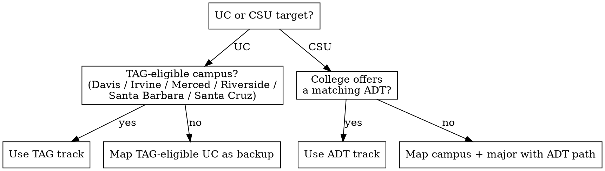

# Transfer Course Planning

This skill turns a community college student's goal — transfer to this university, this major — into a term-by-term course plan and a rendered one-page planner per target. Every articulation, GE-area, AP-credit, TAG, or ADT claim must trace to assist.org or a community college's own published chart. Never assert one from memory.

## When to use

- "I want to transfer to X and don't know what classes to take"
- "Which of my AP scores count?"
- "Is there a guaranteed option?"
- "What do I still need for my major?"

## When not to use

- Non-California community colleges
- Graduate or second-bachelor's transfers
- The articulation agreement is already fully mapped
- Requests for essay or financial-aid help

## Step 1 — Intake

Interactive: use the question tool for structured fields, free text for lists. Non-interactive: present as a numbered form.

| Field | Notes |
|---|---|
| From — community college | exact name for assist.org |
| To — target universities | each primary target gets its own planner |
| Major + degree flavor | exact assist.org string; B.A. vs B.S. if prep differs |
| Current term + courses now | — |
| Prior college coursework + grades | dual enrollment, other CCs, summer |
| AP / IB exams + scores | — |
| Target transfer term | or "earliest possible" |
| Units per term | 12 / 15 / 18 |
| Summer courses OK? | — |
| Guaranteed-admission backup? | UC → TAG, CSU → ADT |
| Cross / concurrent enrollment at a target? | — |
| Language background | years of same HS language + grade; native language; AP exam |
| Constraints | work hours, online-only, courses to avoid, campus prefs |

## Step 2 — Pull the data

Per target from → to → major: get the assist.org major agreement (see references/assist-navigation.md) and record the catalog year actually used. Get the college's Cal-GETC list — flag students on IGETC / CSU GE-Breadth (began before Fall 2025). Get the college's AP/IB chart. For CSU targets, check for a matching ADT and pull its Transfer Model Curriculum. If the university uses its own lower-division GE, pull that campus GE/Breadth agreement too.

## Step 3 — Reconcile

Mark current and completed courses against major prep and GE areas. Apply AP/IB to GE areas from the college's chart (never assumed), and to major prep only when the agreement or campus says so (flag "confirm"). Flag every "No Course Articulated" / "must be taken at the university" item as an after-transfer list. Compute remaining major prep and GE. See references/reconciliation.md.

## Step 4 — Admission scaffolding

Per target: minimum transferable units and junior standing; UC 7-course pattern or CSU Golden Four and deadline terms; minimum vs competitive GPA and any screening-course GPA; the UC language requirement; impacted / screening / capped status (link the campus's own page); CSU American Institutions. Thresholds are in references/reconciliation.md.

## Step 5 — Guaranteed backup

UC → TAG (offered only by Davis, Irvine, Merced, Riverside, Santa Barbara, Santa Cruz — never Berkeley, UCLA, San Diego; filed September 1–30). CSU → an ADT matching the major. If the primary target offers no guarantee, recommend and fully map one that does. See references/reconciliation.md.

## Step 6 — Cross / concurrent enrollment

If the community college participates with the target (check its transfer center), use it for after-transfer-only courses: ~one lower-division course per term, up to two terms, nominal per-unit fee, letter grade required, ineligible once admitted to any four-year — so schedule these before spring admission decisions.

## Step 7 — Build the term grid

Fill the current term as given. Distribute remaining courses across terms to the transfer term, respecting prerequisite chains and the unit cap; use summer only if allowed; the last planned term is the spring before the transfer term. Keep a cushion over the 60-unit minimum; show the running total including AP and cross-enrollment units.

## Step 8 — Render

Fill templates/planner.html — one artifact per primary target. Always include the caveats block and name the catalog year the agreement came from, noting any fallback to a prior year. See examples/worked-example.md for a full worked case.

## Common mistakes

- Asserting an articulation from memory
- Assuming an AP exam's GE area instead of reading the college's chart
- Forgetting the after-transfer courses exist
- Missing that the target has no TAG
- Putting a cross-enrollment course in the final spring term
- Treating Cal-GETC as covering CSU American Institutions
- Ignoring prerequisite chains when sequencing terms

## Which guarantee applies?

